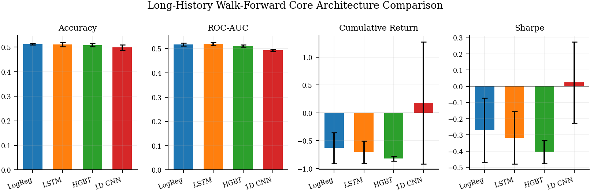
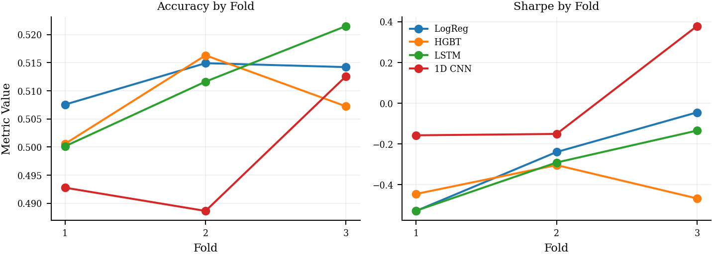
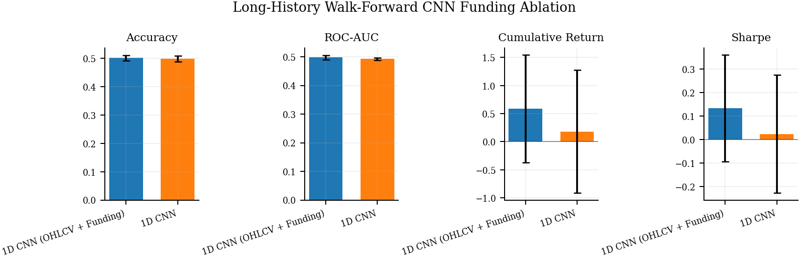

# MarketTensor

MarketTensor is a research-first framework for reproducible directional forecasting experiments in crypto perpetuals and futures markets. The repository is designed as benchmark infrastructure, not a trading product, and emphasizes leak-free preprocessing, strict time-series evaluation, and paper-ready experiment management.

The project is inspired by Rahul Gupta's December 2025 arXiv submission, "S&P 500 Stock's Movement Prediction using CNN", but it deliberately raises the scientific bar. MarketTensor focuses on chronological evaluation, explicit leakage controls, richer crypto-perpetual market signals, stronger baseline models, and experiment structures that can support a publishable benchmark study.

## Why this repository exists

Many financial forecasting repositories mix exploratory code, loosely defined preprocessing, and time-series leakage. MarketTensor exists to provide a more defensible alternative:

- No random shuffling across temporal splits.
- Train, validation, and test segmentation by time.
- Train-only scaling and deterministic preprocessing artifacts.
- Config-driven experiments and ablations.
- Clear separation between prediction metrics and trading metrics.
- Open-source research structure that can evolve into a paper and later into lightweight browser inference.

## Supported signals

Initial data families:

- OHLCV
- Funding rate
- Open-interest-style exchange metrics
- Liquidation feature hooks with explicit source errors until a reproducible historical source is added

Initial target markets:

- BTCUSDT perpetual
- ETHUSDT perpetual
- SOLUSDT perpetual

## Benchmark scope

Implemented or scaffolded experiment dimensions:

- Feature sets: `ohlcv`, `ohlcv_funding`, `ohlcv_open_interest`, `ohlcv_liquidation`, combined variants
- Labels: next-bar direction, k-bar direction, return-threshold classification
- Horizons: 1, 4, 12, 24 bars
- Models: logistic regression, histogram gradient boosting, MLP, 1D CNN, TCN, LSTM
- Evaluation: chronological split, walk-forward evaluation, expanding and rolling windows, pooled and per-symbol analysis

## Repository layout

```text
MarketTensor/
├── configs/
├── data/
├── docs/
├── notebooks/exploration/
├── scripts/
├── src/markettensor/
└── tests/
```

The `.lab/` directory is reserved for gitignored daily research notes and experiment journal entries.

## Quickstart

1. Create a virtual environment and install the project:

```bash
python3 -m venv .venv
source .venv/bin/activate
pip install -e .[dev]
pre-commit install
```

2. Download raw futures archives:

```bash
python scripts/download_data.py --symbol BTCUSDT --interval 1h
```

3. Build a processed dataset:

```bash
python scripts/build_dataset.py --config-name cnn_ohlcv_funding
```

4. Train a model:

```bash
python scripts/train.py --config-name cnn_ohlcv_funding
```

5. Evaluate a run:

```bash
python scripts/evaluate.py --run-id latest
python scripts/backtest.py --run-id latest
python scripts/export_onnx.py --run-id latest
```

## Example experiment configs

- `cnn_ohlcv`
- `cnn_ohlcv_funding`
- `cnn_ohlcv_liquidation`
- `cnn_combined_all`
- `lstm_ohlcv`
- `logistic_ohlcv`
- `mlp_ohlcv_open_interest`

Each experiment stores the resolved Hydra configuration, feature manifest, scaler parameters, metrics, predictions, and model artifacts for reproducibility.

## Long-History Walk-Forward Snapshot

The repository now includes a longer-history walk-forward benchmark over raw futures archives downloaded for `2023-01-01` through `2025-12-31`, using expanding-window evaluation on `BTCUSDT`, `ETHUSDT`, and `SOLUSDT` `1h` bars. The saved fold tables in [docs/results/long_history_core_architectures_summary.csv](docs/results/long_history_core_architectures_summary.csv) and [docs/results/long_history_cnn_funding_ablation_summary.csv](docs/results/long_history_cnn_funding_ablation_summary.csv) cover three expanding folds whose test windows span `2024-10-19` through `2025-09-13` (UTC).

Current headline results on this longer-history benchmark:

- Best mean accuracy: `LogReg` at `0.5122`
- Best mean ROC-AUC: `LSTM` at `0.5194`
- Best mean cumulative return: `1D CNN` at `0.1802`
- Best mean Sharpe: `1D CNN` at `0.0233`
- Funding ablation: `1D CNN (OHLCV + Funding)` improves the mean walk-forward Sharpe to `0.1330` versus `0.0233` for `1D CNN`

The important scientific point is not that one model is dramatically strong. On this materially longer sample, the benchmark is much harder than the short Q1 2024 slice: discrimination is modest, cost-adjusted results are unstable, and only the CNN variants show slightly positive mean trading metrics with large fold-to-fold variance.







Recreate the longer-history tables and figures with:

```bash
python scripts/run_walk_forward.py \
  --suite-name long_history_core_architectures \
  --config-name logistic_ohlcv \
  --config-name hgbt_ohlcv \
  --config-name lstm_ohlcv \
  --config-name cnn_ohlcv \
  --symbols BTCUSDT ETHUSDT SOLUSDT
```

```bash
python scripts/run_walk_forward.py \
  --suite-name long_history_cnn_funding_ablation \
  --config-name cnn_ohlcv \
  --config-name cnn_ohlcv_funding \
  --symbols BTCUSDT ETHUSDT SOLUSDT
```

```bash
python scripts/generate_walk_forward_figures.py \
  --summary-csv docs/results/long_history_core_architectures_summary.csv \
  --folds-csv docs/results/long_history_core_architectures_folds.csv \
  --prefix long_history_core_architectures \
  --title "Long-History Walk-Forward Core Architecture Comparison"
```

## Methodology principles

- Chronological train/validation/test splits only
- Optional purge and embargo support for overlapping labels
- Lagged feature alignment to avoid contemporaneous leakage
- Deterministic seeds
- Clear distinction between statistical performance and simulated trading outcomes
- Reproducible experiment registry and artifact layout

See [docs/methodology.md](docs/methodology.md), [docs/reproducibility.md](docs/reproducibility.md), and [docs/paper_notes.md](docs/paper_notes.md) for details.

## Roadmap

- Add reproducible liquidation data integration
- Extend exchange adapters beyond Binance USD-M futures
- Add richer microstructure features such as basis and mark-index spread
- Expand experiment registry outputs into paper tables and publication figures
- Export lightweight models for browser-based inference and chart-indicator workflows

## Disclaimer

MarketTensor is research infrastructure for forecasting experiments. It is not investment advice, not a trading recommendation system, and not a production execution stack.
